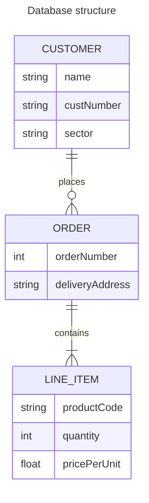

# Database architecture
The database is served by postgresql, the versioning is done with golang-migrate.

Here is the structure of the database:

```mermaid
---
title: Database structure
---
erDiagram
    CUSTOMER {
        string name
        string custNumber
        string sector
    }
    ORDER {
        int orderNumber
        string deliveryAddress
    }
    LINE_ITEM {
        string productCode
        int quantity
        float pricePerUnit
    }

    CUSTOMER ||--o{ ORDER : places
    ORDER ||--|{ LINE_ITEM : contains
```

